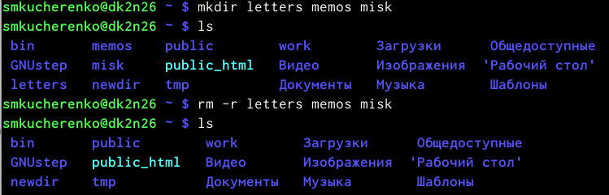

---
## Front matter
lang: ru-RU
title: Лабораторная работа №3
subtitle: Работа с Markdown.
author:
  - Кучеренко С.М.
institute:
  - Российский университет дружбы народов, Москва, Россия

## i18n babel
babel-lang: russian
babel-otherlangs: english

## Formatting pdf
toc: false
toc-title: Содержание
slide_level: 2
aspectratio: 169
section-titles: true
theme: metropolis
header-includes:
 - \metroset{progressbar=frametitle,sectionpage=progressbar,numbering=fraction}
 - '\makeatletter'
 - '\beamer@ignorenonframefalse'
 - '\makeatother'
---

# Информация

## Докладчик

  * Кучеренко София
  * студент 1го курса НММбд-02-22
  * Российский университет дружбы народов
  * [1132226498@pfur.ru](mailto:1132226498@pfur.ru)
  * <https://github.com/sshkiperr/study_2022-2023_os-intro>

# Цель работы

Приобрести практические навыки взаимодействия с системой посредством командной строки.

# Выполнение лабораторной работы

## Определим полное имя домашнего каталога.

{ #fig:001 width=70% }

## Перейдите в каталог /tmp и выведем на экран содержимое каталога с помощью команды ls.

{ #fig:001 width=70% }

## Применим команду ls с опцией -a, с ее помощью выведем скрытые каталоги.

{ #fig:001 width=70% }

## Применим команду ls с опцией -l, с ее помощью вывели подробную информацию о файлах и каталогах.

{ #fig:001 width=70% }

## Определим, есть ли в каталоге /var/spool подкаталог с именем cron? Он там есть

{ #fig:001 width=70% }

## Перейдем в Ваш домашний каталог и выведем на экран его содержимое. Определим, кто является владельцем файлов и подкаталогов?

{ #fig:001 width=70% }

## В домашнем каталоге создадим новый каталог с именем newdir.

{ #fig:001 width=70% }

## В каталоге ~/newdir создадим новый каталог с именем morefun.

{ #fig:001 width=70% }

## В домашнем каталоге создадим одной командой три новых каталога с именами letters, memos, misk. Затем удалим эти каталоги одной командой.

{ #fig:001 width=70% }

## Попробуем удалить ранее созданный каталог ~/newdir командой rm. Проверим, был ли каталог удалён.
Без -r мы бы не смогли удалить не пустые каталоги.

{ #fig:001 width=70% }

## С помощью команды man определим, какую опцию команды ls нужно использовать для просмотра содержимого не только указанного каталога, но и подкаталогов, входящих в него.

{ #fig:001 width=70% }

## С помощью команды man определим набор опций команды ls, позволяющий отсортировать по времени последнего изменения выводимый список содержимого каталога с развёрнутым описанием файлов.

{ #fig:001 width=70% }

## Далее c помощью команды man выведем несколько команд.
cd-отвечает за переходы между каталогами
pwd-вывод нахождения на данный момент
mkdir-создание каталогов
rmdir-удаление пустых каталогов
rm-удаление файлов и директорий

{ #fig:001 width=70% }
{ #fig:001 width=70% }
{ #fig:001 width=70% }
{ #fig:001 width=70% }
{ #fig:001 width=70% }

## Используя информацию, полученную при помощи команды history, выполним модификацию и исполнение нескольких команд из буфера команд.

{ #fig:001 width=70% }

## Контрольные вопросы

Что такое командная строка? Термина для работы с файлами, каталогами.
При помощи какой команды можно определить абсолютный путь текущего каталога?  pwd
При помощи какой команды и каких опций можно определить только тип файлов и их имена в текущем каталоге? Приведите примеры. ls -l
Каким образом отобразить информацию о скрытых файлах? Приведите примеры. ls -a
При помощи каких команд можно удалить файл и каталог? Можно ли это сделать одной и той же командой? Приведите примеры. rm/rmdir рм не удалит не пустой каталог.
Каким образом можно вывести информацию о последних выполненных пользователем командах? работы? history
Как воспользоваться историей команд для их модифицированного выполнения? Приведите примеры. !<номер команды>:s/чтоменяем/начтоменяем
Приведите примеры запуска нескольких команд в одной строке.
Дайте определение и приведите примера символов экранирования. символы замены стандартных слов ~=home
Охарактеризуйте вывод информации на экран после выполнения команды ls с опцией l. Вывод расширенной информации о файле-вес, название, защита.
Что такое относительный путь к файлу? Приведите примеры использования относительного и абсолютного пути при выполнении какой-либо команды.
Как получить информацию об интересующей вас команде? man
Какая клавиша или комбинация клавиш служит для автоматического дополнения вводимых команд? Ctrl+R

## Выводы

В данной лабораторной работе мы познакомились с командной строкой, научились простейшим командам.

:::
