---
## Front matter
lang: ru-RU
title: Лабораторная работа №5
subtitle: Анализ файловой системы Linux. Команды для работы с файлами и каталогами..
author:
  - Кучеренко С.М.
institute:
  - Российский университет дружбы народов, Москва, Россия

## i18n babel
babel-lang: russian
babel-otherlangs: english

## Formatting pdf
toc: false
toc-title: Содержание
slide_level: 2
aspectratio: 169
section-titles: true
theme: metropolis
header-includes:
 - \metroset{progressbar=frametitle,sectionpage=progressbar,numbering=fraction}
 - '\makeatletter'
 - '\beamer@ignorenonframefalse'
 - '\makeatother'
---

# Информация

## Докладчик

  * Кучеренко София
  * студент 1го курса НММбд-02-22
  * Российский университет дружбы народов
  * [1132226498@pfur.ru](mailto:1132226498@pfur.ru)
  * <https://github.com/sshkiperr/study_2022-2023_os-intro>

## Цель работы

Ознакомление с файловой системой Linux, её структурой, именами и содержанием каталогов. Приобретение практических навыков по применению команд для работы с файлами и каталогами.

## Выполнение лабораторной работы

## Выполним все примеры, приведённые в первой части описания лабораторной работы.

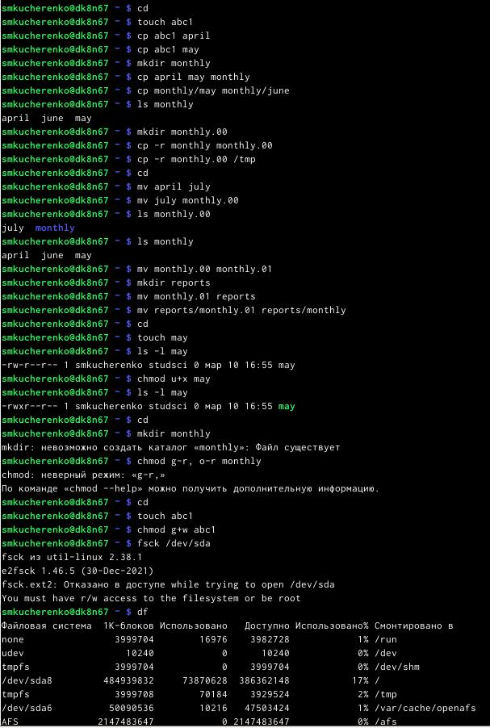{#fig:001 width=70%}

## Скопируем файл /usr/include/sys/io.h в домашний каталог и назовём его equipment.

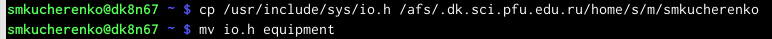{#fig:001 width=70%}

## В домашнем каталоге создадим директорию ~/ski.plases, переместим файл equipment в каталог, а затем переименуем файл ~/ski.plases/equipment в ~/ski.plases/equiplist.

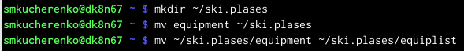{#fig:001 width=70%}

## Создадим в домашнем каталоге файл abc1 и скопируем его в каталог ~/ski.plases, назовем его equiplist2.

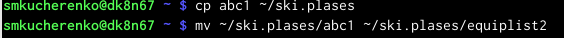{#fig:001 width=70%}

## Создадим каталог с именем equipment в каталоге ~/ski.plases и переместим в него файлы ~/ski.plases/equiplist и equiplist2.

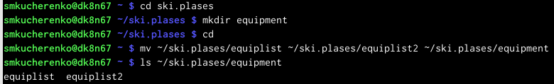{#fig:001 width=70%}

## Создадим и переместим каталог ~/newdir в каталог ~/ski.plases и назовём его plans. 

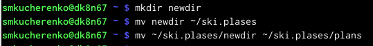{#fig:001 width=70%}

## Определим опции команды chmod, необходимые для того, чтобы присвоить перечисленным ниже файлам выделенные права доступа, считая, что в начале таких прав нет:
drwxr--r-- ... australia
drwx--x--x ... play
-r-xr--r-- ... my_os
-rw-rw-r-- ... feathers

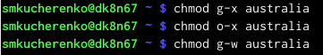{#fig:001 width=70%}

{#fig:001 width=70%}

{#fig:001 width=70%}

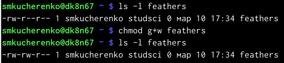{#fig:001 width=70%}

## Просмотрим содержимое файла /etc/password. (такого файла нет)

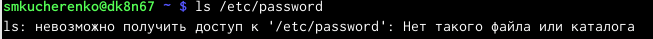{#fig:001 width=70%}

## Скопируем файл ~/feathers в файл ~/file.old, переместим файл ~/file.old в каталог ~/play и скопируем каталог ~/play в каталог ~/fun.

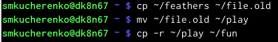{#fig:001 width=70%}

## Переместим каталог ~/fun в каталог ~/play и назовем его games.

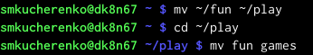{#fig:001 width=70%}

## Лишим владельца файла ~/feathers права на чтение.

{#fig:001 width=70%}

Если мы попытаемся просмотреть файл ~/feathers командой cat, то будет отказано в доступе, так как мы лишили права на чтение.

## Лишим владельца каталога ~/play права на выполнение, затем дадим владельцу каталога ~/play право на выполнение.

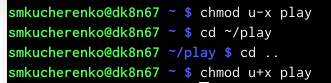{#fig:001 width=70%}

## Выводы

В данной лабораторной работе мы познакомились с командной строкой, научились простейшим командам.

:::
