---
## Front matter
title: "Лабораторная работа №5"
subtitle: "Анализ файловой системы Linux. Команды для работы с файлами и каталогами."
author: "Кучеренко София"

## Generic otions
lang: ru-RU
toc-title: "Содержание"

## Bibliography
bibliography: bib/cite.bib
csl: pandoc/csl/gost-r-7-0-5-2008-numeric.csl

## Pdf output format
toc: true # Table of contents
toc-depth: 2
lof: true # List of figures
lot: true # List of tables
fontsize: 12pt
linestretch: 1.5
papersize: a4
documentclass: scrreprt
## I18n polyglossia
polyglossia-lang:
  name: russian
  options:
	- spelling=modern
	- babelshorthands=true
polyglossia-otherlangs:
  name: english
## I18n babel
babel-lang: russian
babel-otherlangs: english
## Fonts
mainfont: PT Serif
romanfont: PT Serif
sansfont: PT Sans
monofont: PT Mono
mainfontoptions: Ligatures=TeX
romanfontoptions: Ligatures=TeX
sansfontoptions: Ligatures=TeX,Scale=MatchLowercase
monofontoptions: Scale=MatchLowercase,Scale=0.9
## Biblatex
biblatex: true
biblio-style: "gost-numeric"
biblatexoptions:
  - parentracker=true
  - backend=biber
  - hyperref=auto
  - language=auto
  - autolang=other*
  - citestyle=gost-numeric
## Pandoc-crossref LaTeX customization
figureTitle: "Рис."
tableTitle: "Таблица"
listingTitle: "Листинг"
lofTitle: "Список иллюстраций"
lotTitle: "Список таблиц"
lolTitle: "Листинги"
## Misc options
indent: true
header-includes:
  - \usepackage{indentfirst}
  - \usepackage{float} # keep figures where there are in the text
  - \floatplacement{figure}{H} # keep figures where there are in the text
---

# Цель работы

Ознакомление с файловой системой Linux, её структурой, именами и содержанием каталогов. Приобретение практических навыков по применению команд для работы с файлами и каталогами.

# Выполнение лабораторной работы

Выполним все примеры, приведённые в первой части описания лабораторной работы.

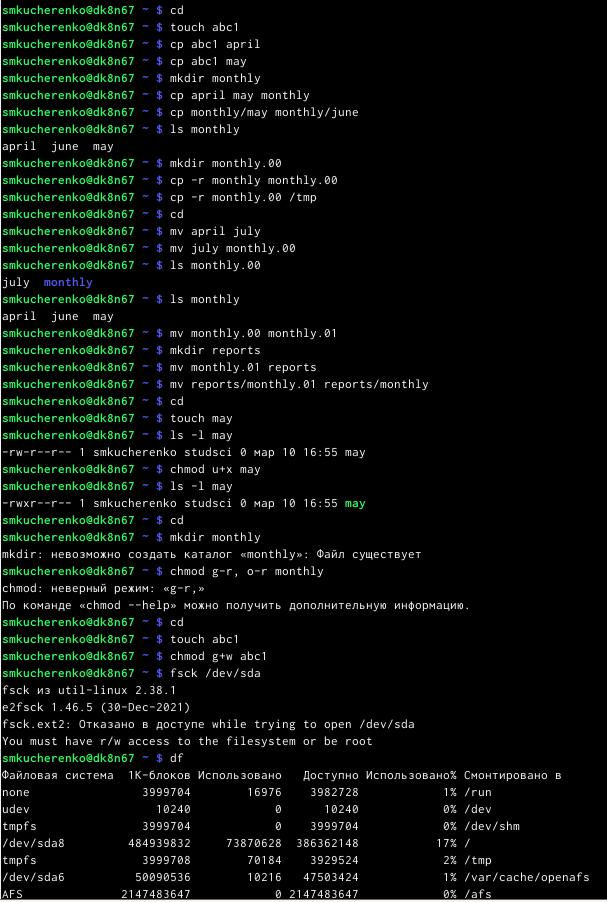{#fig:001 width=70%}

Скопируем файл /usr/include/sys/io.h в домашний каталог и назовём его equipment.

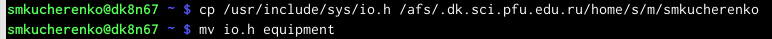{#fig:001 width=70%}

В домашнем каталоге создадим директорию ~/ski.plases, переместим файл equipment в каталог, а затем переименуем файл ~/ski.plases/equipment в ~/ski.plases/equiplist.

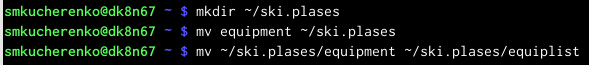{#fig:001 width=70%}

Создадим в домашнем каталоге файл abc1 и скопируем его в каталог ~/ski.plases, назовем его equiplist2.

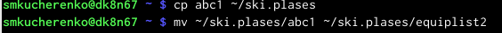{#fig:001 width=70%}

Создадим каталог с именем equipment в каталоге ~/ski.plases и переместим в него файлы ~/ski.plases/equiplist и equiplist2.

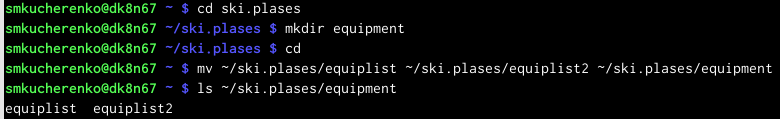{#fig:001 width=70%}

Создадим и переместим каталог ~/newdir в каталог ~/ski.plases и назовём его plans. 

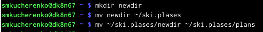{#fig:001 width=70%}

Определим опции команды chmod, необходимые для того, чтобы присвоить перечисленным ниже файлам выделенные права доступа, считая, что в начале таких прав нет:
drwxr--r-- ... australia
drwx--x--x ... play
-r-xr--r-- ... my_os
-rw-rw-r-- ... feathers

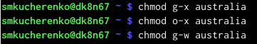{#fig:001 width=70%}

{#fig:001 width=70%}

{#fig:001 width=70%}

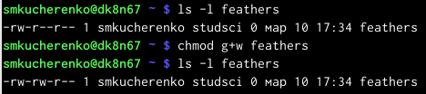{#fig:001 width=70%}

Просмотрим содержимое файла /etc/password. (такого файла нет)

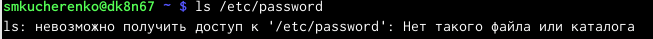{#fig:001 width=70%}

Скопируем файл ~/feathers в файл ~/file.old, переместим файл ~/file.old в каталог ~/play и скопируем каталог ~/play в каталог ~/fun.

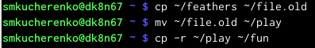{#fig:001 width=70%}

Переместим каталог ~/fun в каталог ~/play и назовем его games.

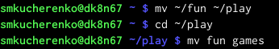{#fig:001 width=70%}

Лишим владельца файла ~/feathers права на чтение.

{#fig:001 width=70%}

Если мы попытаемся просмотреть файл ~/feathers командой cat, то будет отказано в доступе, так как мы лишили права на чтение.

Лишим владельца каталога ~/play права на выполнение, затем дадим владельцу каталога ~/play право на выполнение.

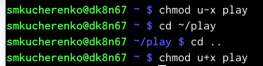{#fig:001 width=70%}

# Контрольные вопросы

1. Дайте характеристику каждой файловой системе, существующей на жёстком диске компьютера, на котором вы выполняли лабораторную работу.

На жестком диске компьютера, на котором я выполняла лабораторную работу, были установлены следующие файловые системы: ext4, swap и vfat. ext4 - это распространенная файловая система для Linux, vfat - файловая система для устройств с файловыми системами FAT32 и FAT16,

2. Приведите общую структуру файловой системы и дайте характеристику каждой директории первого уровня этой структуры.

Общая структура файловой системы Linux: корневой каталог (/), каталоги исполняемых файлов (/bin), конфигурационные файлы (/etc), домашние каталоги пользователей (/home), временные файлы (/tmp), системные файлы (/sys) и устройства (/dev).

3. Какая операция должна быть выполнена, чтобы содержимое некоторой файловой системы было доступно операционной системе?

Необходимо произвести монтирование файловой системы.

4. Назовите основные причины нарушения целостности файловой системы. Как устранить повреждения файловой системы?

Основные причины нарушения целостности файловой системы: сбои в питании, неправильное завершение работы, ошибки в работе программного обеспечения. Повреждения файловой системы могут быть устранены с помощью специализированных инструментов, таких как fsck.

5. Как создаётся файловая система?

Файловая система создается с помощью утилиты mkfs, которая форматирует блочное устройство, подготавливая его для использования.

6. Дайте характеристику командам для просмотра текстовых файлов.

Основные команды для просмотра текстовых файлов: cat (вывод содержимого файла в терминал), less (постраничный просмотр содержимого файла), head (вывод первых строк файла), tail (вывод последних строк файла).

7. Приведите основные возможности команды cp в Linux

Основные возможности команды cp в Linux: копирование файлов и директорий, рекурсивное копирование содержимого директории, переименование файлов и директорий, установка разрешений на файлы и директории при копировании.

# Выводы

Я ознакомилась с файловой системой Linux, её структурой, именами и содержанием каталогов, а также приобрела навыки по применению команд для работы с файлами и каталогами.

:::

