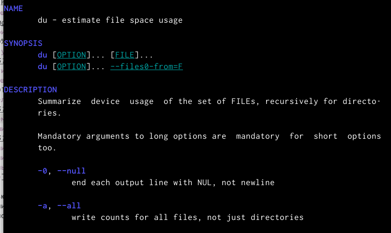

---
## Front matter
lang: ru-RU
title: Лабораторная работа №6
subtitle: Поиск файлов. Перенаправление ввода-вывода. Просмотр запущенных процессов
author:
  - Кучеренко С.М.
institute:
  - Российский университет дружбы народов, Москва, Россия

## i18n babel
babel-lang: russian
babel-otherlangs: english

## Formatting pdf
toc: false
toc-title: Содержание
slide_level: 2
aspectratio: 169
section-titles: true
theme: metropolis
header-includes:
 - \metroset{progressbar=frametitle,sectionpage=progressbar,numbering=fraction}
 - '\makeatletter'
 - '\beamer@ignorenonframefalse'
 - '\makeatother'
---

# Информация

## Докладчик

  * Кучеренко София
  * студент 1го курса НММбд-02-22
  * Российский университет дружбы народов
  * [1132226498@pfur.ru](mailto:1132226498@pfur.ru)
  * <https://github.com/sshkiperr/study_2022-2023_os-intro>

# Цель работы

Ознакомиться с инструментами поиска файлов и фильтрации текстовых данных. Приобрести практические навыки: по управлению процессами (и заданиями), по проверке использования диска и обслуживанию файловых систем.

# Выполнение лабораторной работы

##

{#fig:001 width=70%}

##

{#fig:001 width=70%}

##

{#fig:001 width=70%}

##

{#fig:001 width=70%}

##

{#fig:001 width=70%}

##

{#fig:001 width=70%}

##

{#fig:001 width=70%}

##

{#fig:001 width=70%}

##

{#fig:001 width=70%}

##

{#fig:001 width=70%}

##

{#fig:001 width=70%}

##

{#fig:001 width=70%}

##

{#fig:001 width=70%}

##

{#fig:001 width=70%}

##

{#fig:001 width=70%}

##

{#fig:001 width=70%}

##

{#fig:001 width=70%}

##

{#fig:001 width=70%}

##

{#fig:001 width=70%}

##

{#fig:001 width=70%}

##

{#fig:001 width=70%}

##

{#fig:001 width=70%}

С помощью type d мы попросили команду find искать только каталоги. С помощью maxdepth 1 мы попросили команду find сохранить поиск только на текущем уровне (и не заходить в подкаталоги). Введёная команда также показывает скрытые каталоги.
    
# Выводы

Я ознакомилась с инструментами поиска файлов и фильтрации текстовых данных. Приобрести практические навыки: по управлению процессами (и заданиями), по проверке использования диска и обслуживанию файловых систем.

:::
