---
## Front matter
lang: ru-RU
title: Лабораторная работа №7.
subtitle: Командная оболочка Midnight Commander.
author:
  - Кучеренко С.М.
institute:
  - Российский университет дружбы народов, Москва, Россия

## i18n babel
babel-lang: russian
babel-otherlangs: english

## Formatting pdf
toc: false
toc-title: Содержание
slide_level: 2
aspectratio: 169
section-titles: true
theme: metropolis
header-includes:
 - \metroset{progressbar=frametitle,sectionpage=progressbar,numbering=fraction}
 - '\makeatletter'
 - '\beamer@ignorenonframefalse'
 - '\makeatother'
---

# Информация

## Докладчик

  * Кучеренко София
  * студент 1го курса НММбд-02-22
  * Российский университет дружбы народов
  * [1132226498@pfur.ru](mailto:1132226498@pfur.ru)
  * <https://github.com/sshkiperr/study_2022-2023_os-intro>

## Цель работы

Освоить основные возможности командной оболочки Midnight Commander. Приобрести навыки практической работы по просмотру каталогов и файлов, а также манипуляций с ними.

## Задание

Выполнить задания по mc

Создать отчет и презентацию в md

Загрузить скринкасты

## Выполнение лабораторной работы

## 

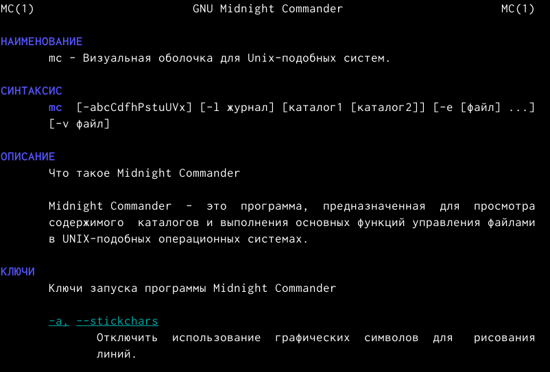

## 

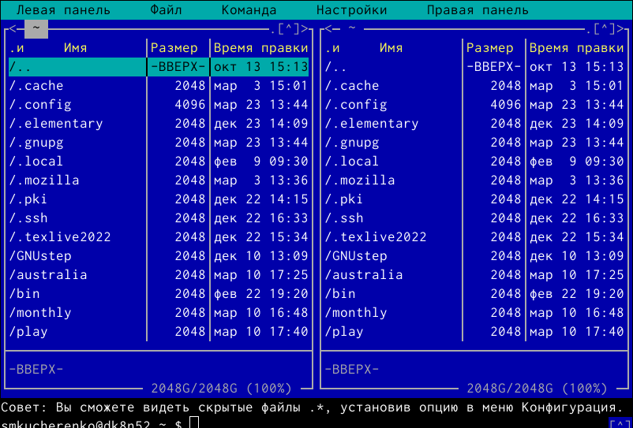

Выполним несколько операций в mc, используя управляющие клавиши:

## 

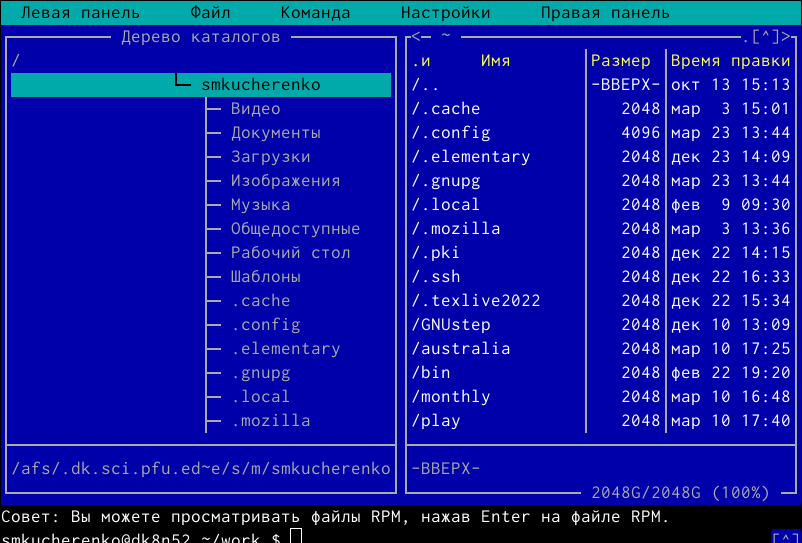

## 

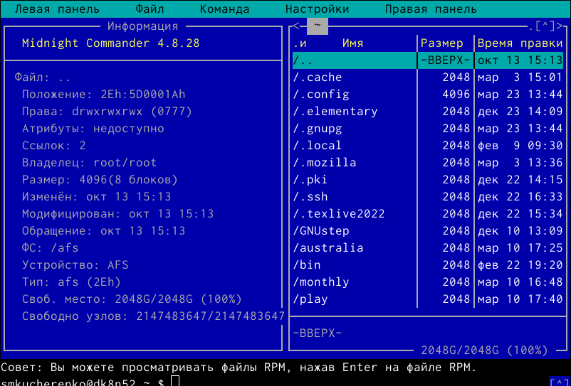

## 

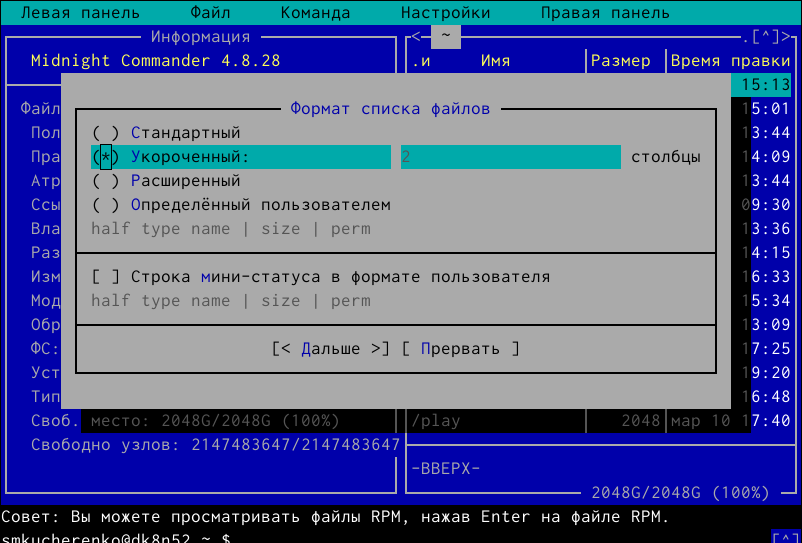

## 

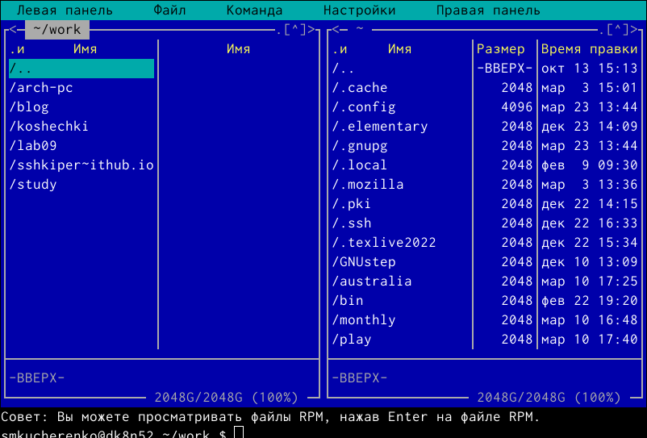

## 

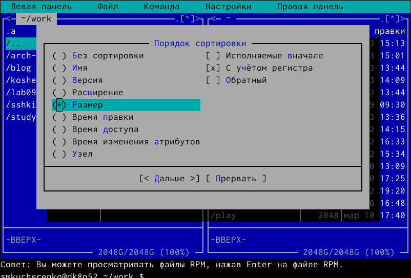

## 

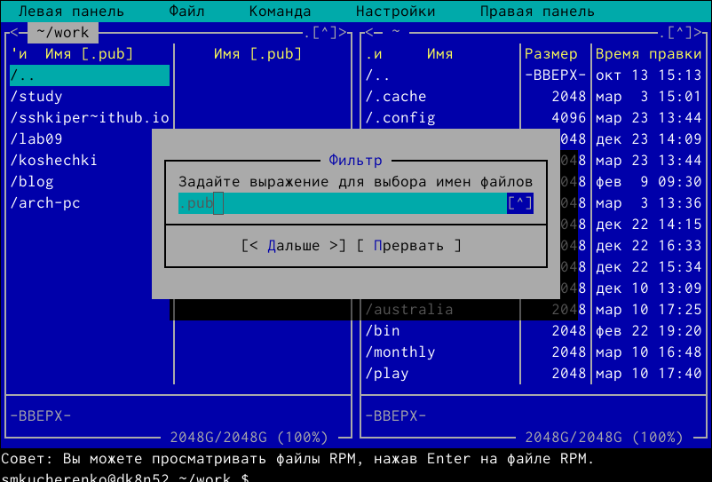

## 

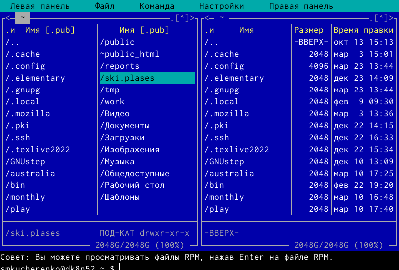

## 

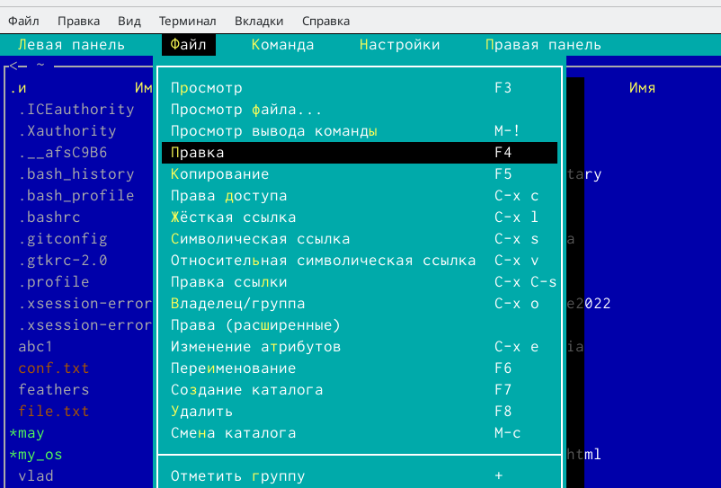

## 

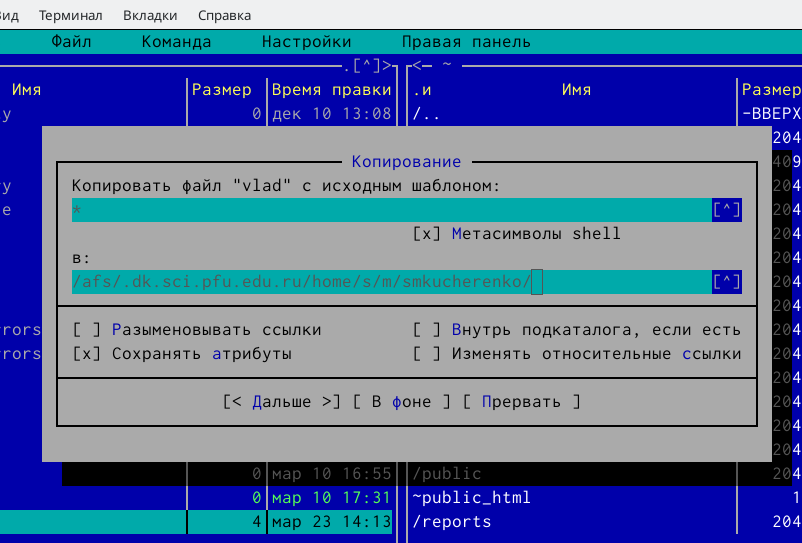

## 

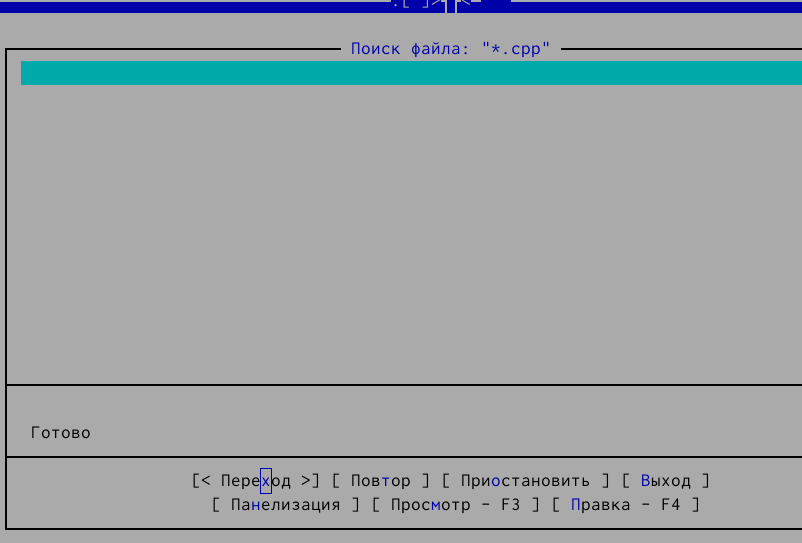

## 

## 

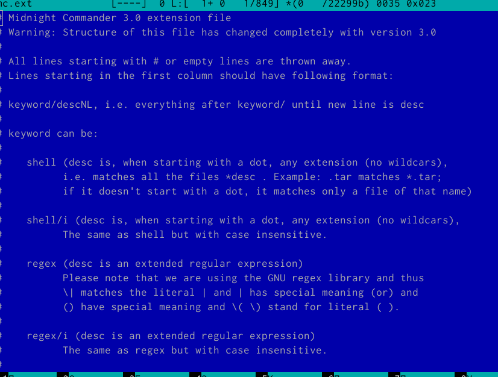

## 

## 

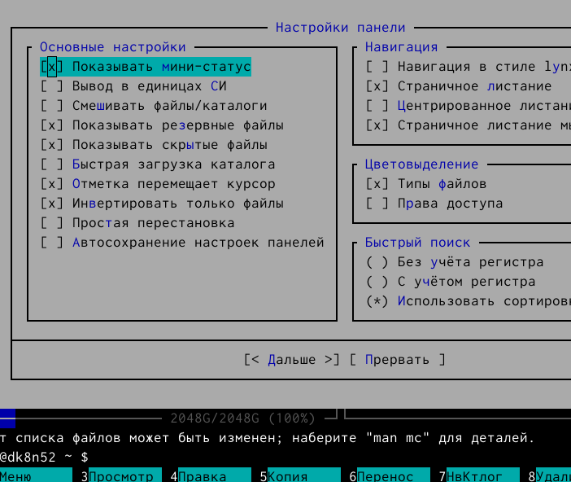

## 

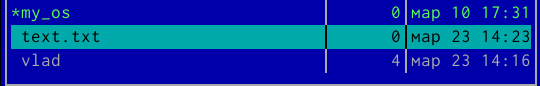

## 

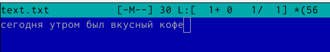

## 

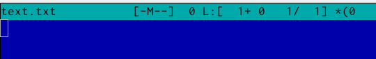

## 

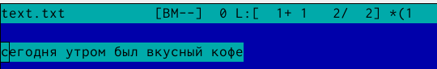

## 

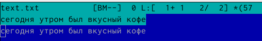

## 

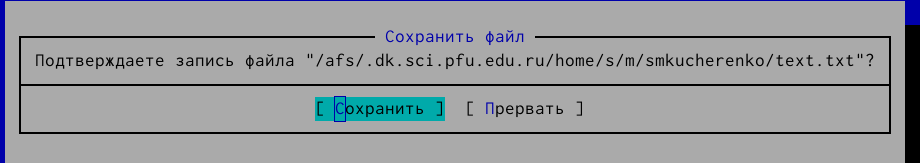

## 

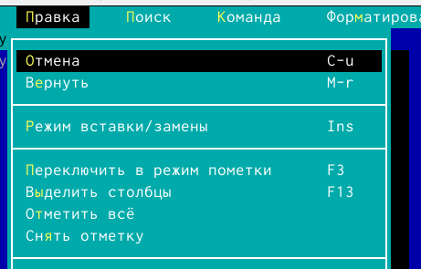

## 

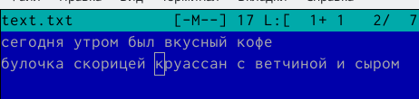

## 

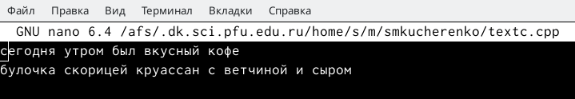

## 

## Выводы

Я освоила основные возможности командной оболочки Midnight Commander и приобрела навыки практической работы по просмотру каталогов и файлов, а также манипуляций с ними.

:::
