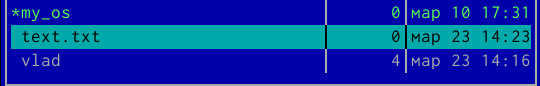
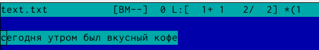
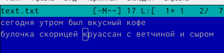

---
## Front matter
title: "Лабораторная работа №7."
subtitle: "Командная оболочка Midnight Commander."
author: "Кучеренко София"

## Generic otions
lang: ru-RU
toc-title: "Содержание"

## Bibliography
bibliography: bib/cite.bib
csl: pandoc/csl/gost-r-7-0-5-2008-numeric.csl

## Pdf output format
toc: true # Table of contents
toc-depth: 2
lof: true # List of figures
lot: true # List of tables
fontsize: 12pt
linestretch: 1.5
papersize: a4
documentclass: scrreprt
## I18n polyglossia
polyglossia-lang:
  name: russian
  options:
	- spelling=modern
	- babelshorthands=true
polyglossia-otherlangs:
  name: english
## I18n babel
babel-lang: russian
babel-otherlangs: english
## Fonts
mainfont: PT Serif
romanfont: PT Serif
sansfont: PT Sans
monofont: PT Mono
mainfontoptions: Ligatures=TeX
romanfontoptions: Ligatures=TeX
sansfontoptions: Ligatures=TeX,Scale=MatchLowercase
monofontoptions: Scale=MatchLowercase,Scale=0.9
## Biblatex
biblatex: true
biblio-style: "gost-numeric"
biblatexoptions:
  - parentracker=true
  - backend=biber
  - hyperref=auto
  - language=auto
  - autolang=other*
  - citestyle=gost-numeric
## Pandoc-crossref LaTeX customization
figureTitle: "Рис."
tableTitle: "Таблица"
listingTitle: "Листинг"
lofTitle: "Список иллюстраций"
lotTitle: "Список таблиц"
lolTitle: "Листинги"
## Misc options
indent: true
header-includes:
  - \usepackage{indentfirst}
  - \usepackage{float} # keep figures where there are in the text
  - \floatplacement{figure}{H} # keep figures where there are in the text
---

# Цель работы

Освоить основные возможности командной оболочки Midnight Commander. Приобрести навыки практической работы по просмотру каталогов и файлов, а также манипуляций с ними.

# Задание

Выполнить задания по mc

Создать отчет и презентацию в md

Загрузить скринкасты

# Теоретическое введение

Функционоальные клавиши mc:

F1 Вызов контекстно-зависимой подсказки
F2 Вызов пользовательского меню с возможностью создания и/или допол-
нения дополнительных функций
F3 Просмотр содержимого файла, на который указывает подсветка в ак-
тивной панели (без возможности редактирования)
F4 Вызов встроенного в mc редактора для изменения содержания файла,
на который указывает подсветка в активной панели
F5 Копирование одного или нескольких файлов, отмеченных в первой
(активной) панели, в каталог, отображаемый на второй панели
F6 Перенос одного или нескольких файлов, отмеченных в первой (актив-
ной) панели, в каталог, отображаемый на второй панели
F7 Создание подкаталога в каталоге, отображаемом в активной панели
F8 Удаление одного или нескольких файлов (каталогов), отмеченных в пер-
вой (активной) панели файлов
F9 Вызов меню mc
F10 Выход из mc

# Выполнение лабораторной работы

Выполним несколько операций в mc, используя управляющие клавиши:

# Выводы

Я освоила основные возможности командной оболочки Midnight Commander и приобрела навыки практической работы по просмотру каталогов и файлов, а также манипуляций с ними.

