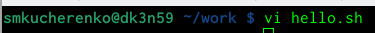
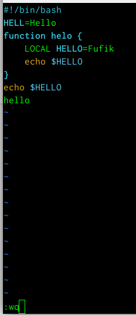
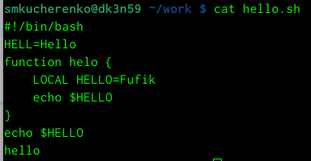
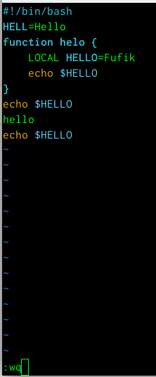
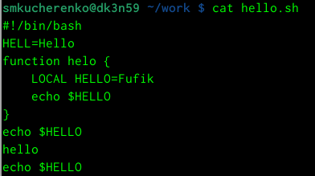

---
## Front matter
title: "Лабораторная работа №8"
subtitle: "Текстовый редактор vi"
author: "Кучеренко София"

## Generic otions
lang: ru-RU
toc-title: "Содержание"

## Bibliography
bibliography: bib/cite.bib
csl: pandoc/csl/gost-r-7-0-5-2008-numeric.csl

## Pdf output format
toc: true # Table of contents
toc-depth: 2
lof: true # List of figures
lot: true # List of tables
fontsize: 12pt
linestretch: 1.5
papersize: a4
documentclass: scrreprt
## I18n polyglossia
polyglossia-lang:
  name: russian
  options:
	- spelling=modern
	- babelshorthands=true
polyglossia-otherlangs:
  name: english
## I18n babel
babel-lang: russian
babel-otherlangs: english
## Fonts
mainfont: PT Serif
romanfont: PT Serif
sansfont: PT Sans
monofont: PT Mono
mainfontoptions: Ligatures=TeX
romanfontoptions: Ligatures=TeX
sansfontoptions: Ligatures=TeX,Scale=MatchLowercase
monofontoptions: Scale=MatchLowercase,Scale=0.9
## Biblatex
biblatex: true
biblio-style: "gost-numeric"
biblatexoptions:
  - parentracker=true
  - backend=biber
  - hyperref=auto
  - language=auto
  - autolang=other*
  - citestyle=gost-numeric
## Pandoc-crossref LaTeX customization
figureTitle: "Рис."
tableTitle: "Таблица"
listingTitle: "Листинг"
lofTitle: "Список иллюстраций"
lotTitle: "Список таблиц"
lolTitle: "Листинги"
## Misc options
indent: true
header-includes:
  - \usepackage{indentfirst}
  - \usepackage{float} # keep figures where there are in the text
  - \floatplacement{figure}{H} # keep figures where there are in the text
---

# Цель работы

Освоить интерфейс текстового редактора vi. 

# Задание

Выполнить задания по текстовому редактору vi

Создать отчет и презентацию в md

Загрузить скринкасты

# Выполнение лабораторной работы

# Контрольные вопросы

1. Дайте краткую характеристику режимам работы редактора vi.

Ответ: командный режим (command mode) - в этом режиме можно давать команды для редактирования файлов или перейти в другой режим, режим ввода (insert mode) - можно вводить текст в то место, куда указывает курсор, режим последней строки (last line mode) - это специальный режим, в котором редактору даются сложные команды.

2. Как выйти из редактора, не сохраняя произведённые изменения?
Ответ: использовать в командном режиме команду :q!

3. Назовите и дайте краткую характеристику командам позиционирования.
Ответ: есть несколько команд: 0 — переход в начало строки, $ — переход в конец строки, G — переход в конец файла, kG — переход на строку с номером k

4. Что для редактора vi является словом?
Ответ: символ, отделённый пробелом.

5. Каким образом из любого места редактируемого файла перейти в начало (конец) файла?
Ответ: использовать в командном режиме команду G.

6. Назовите и дайте краткую характеристику основным группам команд редактирования.
Ответ: Вставка текста, Вставка строки, Удаление текста, Отмена и повтор произведённых изменений, Копирование текста в буфер, Вставка текста из буфера, Замена текста, Поиск текста

7. Необходимо заполнить строку символами $. Каковы ваши действия?
Ответ: терпеливо заполняем

8. Как отменить некорректное действие, связанное с процессом редактирования?
Ответ: клавиша u.

9. Назовите и дайте характеристику основным группам команд режима последней строки.
Ответ: Копирование и перемещение текста, Запись в файл и выход из редактора.

10. Как определить, не перемещая курсора, позицию, в которой заканчивается строка?
Ответ: перейти в конец строки.

11. Выполните анализ опций редактора vi (сколько их, как узнать их назначение и т.д.).
Ответ: Команда vi имеет специальные опции. Они позволяют: восстановить потерянный файл, если работа vi была прервана; поместить в буфер редактирования несколько файлов и редактировать их по порядку; просмотр файла без риска случайного внесения изменений в него.

12. Как определить режим работы редактора vi?
Ответ: режим работы отображается внизу экрана.

# Выводы

Я освоила интерфейс текстового редактора vi, работая с файлом и командной строкой.

