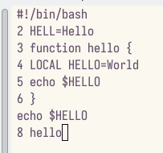

---
## Front matter
lang: ru-RU
title: Лабораторная работа №9.
subtitle: Текстовый редактор emacs.
author:
  - Кучеренко С.М.
institute:
  - Российский университет дружбы народов, Москва, Россия

## i18n babel
babel-lang: russian
babel-otherlangs: english

## Formatting pdf
toc: false
toc-title: Содержание
slide_level: 2
aspectratio: 169
section-titles: true
theme: metropolis
header-includes:
 - \metroset{progressbar=frametitle,sectionpage=progressbar,numbering=fraction}
 - '\makeatletter'
 - '\beamer@ignorenonframefalse'
 - '\makeatother'
---

# Информация

## Докладчик

  * Кучеренко София
  * студент 1го курса НММбд-02-22
  * Российский университет дружбы народов
  * [1132226498@pfur.ru](mailto:1132226498@pfur.ru)
  * <https://github.com/sshkiperr/study_2022-2023_os-intro>

## Цель работы

Познакомиться с операционной системой Linux. Получить практические навыки работы с редактором Emacs

## Задание

Ознакомиться с теоретическим материалом.

Ознакомиться с редактором emacs.

Выполнить упражнения.

Ответить на контрольные вопросы.

## Выполнение лабораторной работы

## 

## 

Создадим файл lab07.sh с помощью комбинации (C-x C-f)

Сохраним файл с помощью комбинации Ctrl-x Ctrl-s (C-x C-s)

## 

Выполним следующие действия над текстом:

1. Вырежем одной командой целую строку (С-k).
2. Вставим эту строку в конец файла (C-y).
3. Выделим область текста (C-space).
4. Скопировать область в буфер обмена (M-w).
5. Вставить область в конец файла.
6. Вновь выделить эту область и на этот раз вырезать её (C-w).
7. Отмените последнее действие (C-/).

Также научились использовать команды по перемещению курсора.

## 

Выведем список активных буферов на экран (C-x C-b):

## 

Переместимся во вновь открытое окно (C-x) o со списком открытых буферов и переключимся на другой буфер.

Переключаемся между буферами, но уже без вывода их списка на экран (C-x b).

## 

Поделим фрейм на 4 части: разделим фрейм на два окна по вертикали (C-x 3), а затем каждое из этих окон на две части по горизонтали (C-x 2)

## 

В каждом из четырёх созданных окон откроем новый буфер (файл) и введем несколько строк текста

## 

Перейдем в режим поиска и замены (M-%) и заменим слово в файле.

Испробуем другой режим поиска, нажав M-s o. Он ищет первое совпадение после курсора. 

## Выводы

Я ознакомилась с операционной системой Linux и получила практические навыки работы с редактором Emacs
