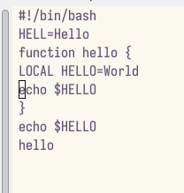

---
## Front matter
title: "Лабораторной работе №9"
subtitle: "Текстовой редактор emacs"
author: "Кучеренко София"

## Generic otions
lang: ru-RU
toc-title: "Содержание"

## Bibliography
bibliography: bib/cite.bib
csl: pandoc/csl/gost-r-7-0-5-2008-numeric.csl

## Pdf output format
toc: true # Table of contents
toc-depth: 2
lof: true # List of figures
lot: true # List of tables
fontsize: 12pt
linestretch: 1.5
papersize: a4
documentclass: scrreprt
## I18n polyglossia
polyglossia-lang:
  name: russian
  options:
	- spelling=modern
	- babelshorthands=true
polyglossia-otherlangs:
  name: english
## I18n babel
babel-lang: russian
babel-otherlangs: english
## Fonts
mainfont: PT Serif
romanfont: PT Serif
sansfont: PT Sans
monofont: PT Mono
mainfontoptions: Ligatures=TeX
romanfontoptions: Ligatures=TeX
sansfontoptions: Ligatures=TeX,Scale=MatchLowercase
monofontoptions: Scale=MatchLowercase,Scale=0.9
## Biblatex
biblatex: true
biblio-style: "gost-numeric"
biblatexoptions:
  - parentracker=true
  - backend=biber
  - hyperref=auto
  - language=auto
  - autolang=other*
  - citestyle=gost-numeric
## Pandoc-crossref LaTeX customization
figureTitle: "Рис."
tableTitle: "Таблица"
listingTitle: "Листинг"
lofTitle: "Список иллюстраций"
lotTitle: "Список таблиц"
lolTitle: "Листинги"
## Misc options
indent: true
header-includes:
  - \usepackage{indentfirst}
  - \usepackage{float} # keep figures where there are in the text
  - \floatplacement{figure}{H} # keep figures where there are in the text
---

## Цель работы

Познакомиться с операционной системой Linux. Получить практические навыки работы с редактором Emacs

## Задание

Ознакомиться с теоретическим материалом.
Ознакомиться с редактором emacs.
Выполнить упражнения.
Ответить на контрольные вопросы.

## Выполнение лабораторной работы

Создадим файл lab07.sh с помощью комбинации (C-x C-f)

Сохраним файл с помощью комбинации Ctrl-x Ctrl-s (C-x C-s)

Выполним следующие действия над текстом:

1. Вырежем одной командой целую строку (С-k).
2. Вставим эту строку в конец файла (C-y).
3. Выделим область текста (C-space).
4. Скопировать область в буфер обмена (M-w).
5. Вставить область в конец файла.
6. Вновь выделить эту область и на этот раз вырезать её (C-w).
7. Отмените последнее действие (C-/).

Научились использовать команды по перемещению курсора.

Выведем список активных буферов на экран (C-x C-b):

Переместимся во вновь открытое окно (C-x) o со списком открытых буферов и переключимся на другой буфер.

Переключаемся между буферами, но уже без вывода их списка на экран (C-x b).

Поделим фрейм на 4 части: разделим фрейм на два окна по вертикали (C-x 3), а затем каждое из этих окон на две части по горизонтали (C-x 2)

В каждом из четырёх созданных окон откроем новый буфер (файл) и введем несколько строк текста

Переключимся в режим поиска (C-s) и найдем несколько слов, присутствующих в тексте, переключаясь между результатами поиска, нажимая C-s. (выход С-g)

Перейдем в режим поиска и замены (M-%) и заменим слово в файле.

Испробуем другой режим поиска, нажав M-s o. Он ищет первое совпадение после курсора. 

## Ответы на контрольные вопросы

1. Кратко охарактеризуйте редактор emacs.

_Ответ_: emacs — экранный редактор текста.

2. Какие особенности данного редактора могут сделать его сложным для освоения новичком?

_Ответ_: совершенно не поддающиеся какой бы то ни было логике сочетания клавиш поставят любого пользователя в тупик. Удачи.

3. Своими словами опишите, что такое буфер и окно в терминологии emacs’а.

_Ответ_: буфер — хранилище текста, окно — хранилище буферов.

4. Можно ли открыть больше 10 буферов в одном окне?

_Ответ_: оказалось, что нет.

5. Какие буферы создаются по умолчанию при запуске emacs?

_Ответ_: 'GNU Emacs' и \*Warnings\*.

6. Какие клавиши вы нажмёте, чтобы ввести следующую комбинацию C-c | и C-c C-|?

_Ответ_: `ctrl-c-shift-\` и `ctrl-c ctrl-shift-\`.

7. Как поделить текущее окно на две части?

_Ответ_: по горизонтали (`C-x 2`) и вертикали (`C-x 3`).

8. В каком файле хранятся настройки редактора emacs?

_Ответ_: `~/.emacs`.

9. Какую функцию выполняет клавиша и можно ли её переназначить?

_Ответ_: перемещение каретки по буферу. Переназначить нельзя.

10. Какой редактор вам показался удобнее в работе vi или emacs? Поясните почему.

_Ответ_: vi оказался удобнее ввиду своей легковесности.

## Выводы

Я ознакомилась с операционной системой Linux и получила практические навыки работы с редактором Emacs
