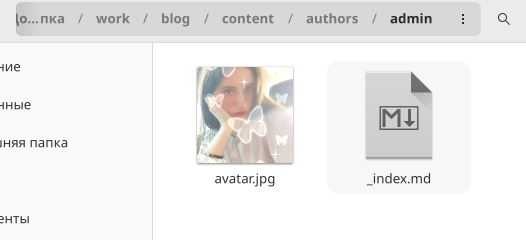
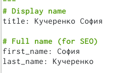
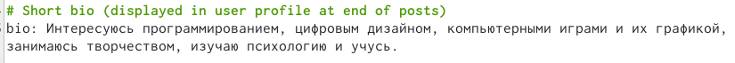
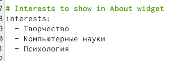
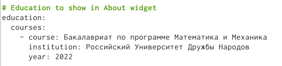
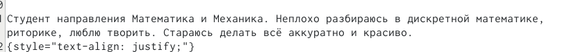
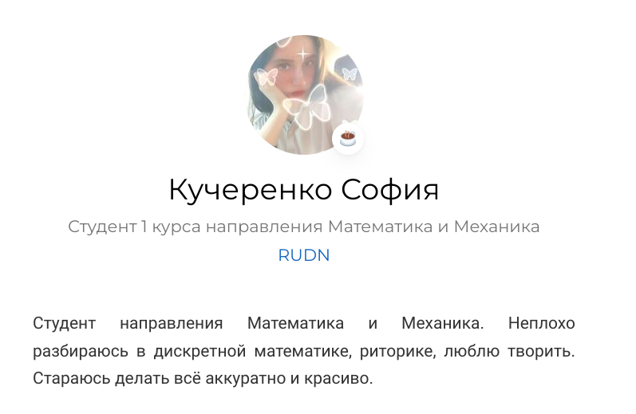
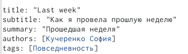
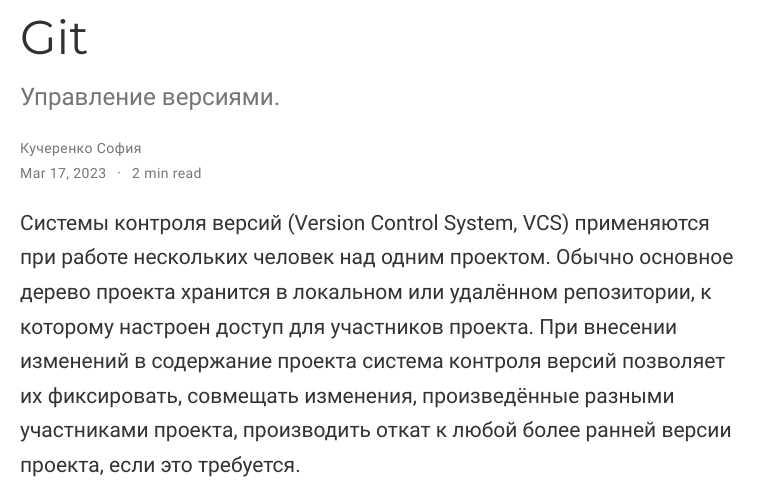

---
## Front matter
lang: ru-RU
title: Отчёт по первому этапу индивидуального проекта.
subtitle: Размещение на Github pages заготовки для персонального сайта.
author:
  - Кучеренко С.М.
institute:
  - Российский университет дружбы народов, Москва, Россия

## i18n babel
babel-lang: russian
babel-otherlangs: english

## Formatting pdf
toc: false
toc-title: Содержание
slide_level: 2
aspectratio: 169
section-titles: true
theme: metropolis
header-includes:
 - \metroset{progressbar=frametitle,sectionpage=progressbar,numbering=fraction}
 - '\makeatletter'
 - '\beamer@ignorenonframefalse'
 - '\makeatother'
---

# Информация

## Докладчик

  * Кучеренко София
  * студент 1го курса НММбд-02-22
  * Российский университет дружбы народов
  * [1132226498@pfur.ru](mailto:1132226498@pfur.ru)
  * <https://github.com/sshkiperr/study_2022-2023_os-intro>

# Цель работы

Целью работы является освоение новых команд терминала, связанных с конструктором статических веб-сайтов Hugo, приобретение практических навыков изменения информации о владельце сайта и добавления новых постов, а также более детальное изучение файлов директории blog персонального проекта.

# Задание

Добавить к сайту данные о себе. Разместить фотографию владельца сайта. Разместить краткое описание владельца сайта (Biography). Добавить информацию об интересах (Interests). Добавить информацию об образовании (Education). Создать два поста.

# Выполнение лабораторной работы

##

##

##

##

##

##

##

##

##

##

##

# Выводы

Освоили новые команды терминала, связанные с конструктором статических веб-сайтов Hugo, приобрели практические навыки изменения информации о владельце сайта и добавления новых постов, а также лучше познакомились с файлами в директории blog персонального проекта.

